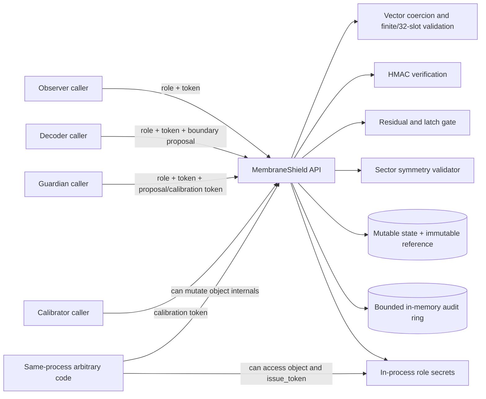
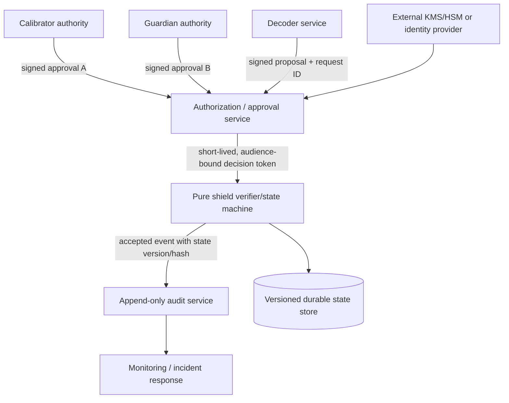

# OES-32 Membrane Shield Protocol
## Threat Modeling and Security Architecture Audit

**Assessment date:** 27 August 2026  
**Assessment subject:** `sparkainlp-x/oes32-membrane-shield`  
**Repository state reviewed:** commit `44969ea` on `main`  
**Prepared by:** Manus AI  
**Assessment type:** Architecture and source-code threat model; not a formal certification or penetration test

---

## 1. Executive assessment

The OES-32 Membrane Shield is a compact, dependency-free Python state machine that attempts to protect a 32-slot bulk/boundary state transition with four classes of controls: role-scoped HMAC tokens, dual-control calibration, residual-based latching, and sector-specific symmetry validation. The implementation is readable, typed, tested, and conservative at the proposal boundary. Rejected proposals generally preserve the previous state, malformed vectors are rejected, and residual breaches trip a latch.

The central security conclusion is that the implementation is a **useful local reference component but not yet a production authorization boundary**. Its strongest controls are mathematical and state-machine checks. Its weakest controls are identity, key lifecycle, trust separation, concurrency, audit integrity, and release governance. In particular, all role secrets live inside one `MembraneShield` object and any code that can access the object can call `issue_token()` for every role. Consequently, the apparent dual control is not independent in the threat model of a compromised or merely over-privileged process: one in-process principal can mint both calibration credentials. The HMAC tokens also do not expire, rotate, revoke, bind to an external principal, or cross a process boundary.

The current repository has good baseline engineering controls: strict typing, 23 tests, a local coverage result of 97.48%, Ruff, mypy, Dependabot, a security policy, CODEOWNERS, issue forms, a release workflow, and a successful main-branch CI run. However, the private repository cannot enable GitHub branch protection on the current plan. That creates a governance gap: the repository has documented review intent but cannot technically enforce required reviews or status checks on `main`.

The recommended decision is **“approve for continued reference development; do not deploy as a sole production authorization or safety control.”** Before production use, the project should externalize identity and key management, enforce genuine dual control across independent trust domains, define a concurrency model, strengthen audit integrity, add resource bounds and property-based testing, and enable protected-branch and signed-release controls on a suitable GitHub plan.

| Overall domain | Rating | Assessment |
| --- | --- | --- |
| State-transition correctness | Moderate assurance | Clear checks and good unit coverage, but limited formal specification and adversarial/property-based testing. |
| Authentication | High risk | Process-local, non-expiring HMAC tokens are not an external identity system. |
| Authorization and dual control | High risk | All role secrets are co-located and token issuance is available on the same object. |
| Integrity of accepted state | Moderate assurance | Residual and symmetry gates are useful, subject to caller input and concurrency assumptions. |
| Availability | Moderate risk | Latching helps contain unsafe updates, but unbounded iterables and concurrent mutation create denial-of-service and race risks. |
| Auditability | High risk | The audit ring is local, bounded, mutable, non-durable, and not tamper-evident. |
| Software supply chain | Moderate risk | Basic CI and Dependabot exist; action pinning, provenance, immutable releases, and enforceable review gates are incomplete. |
| Production readiness | Not approved | Suitable as a reference library after documented integration controls; not sufficient as a standalone security boundary. |

This audit follows a threat-modeling approach consistent with NIST's description of threat modeling as risk assessment that models attack and defense aspects of a logical entity [1], and with OWASP's recommended sequence of system decomposition, threat identification and ranking, mitigations, and review/validation [2].

---

## 2. Scope, evidence, and limitations

### 2.1 In scope

The review covers the Python package under `src/oes32_membrane_shield/`, its public API, state transition logic, token generation and verification, calibration flow, latching behavior, sector validators, audit ring, Monte Carlo helper, tests, packaging metadata, GitHub Actions workflows, Dependabot configuration, CODEOWNERS, issue forms, and repository settings.

The primary implementation evidence is in `src/oes32_membrane_shield/core.py`. The API exports are in `src/oes32_membrane_shield/__init__.py`, the CLI is in `src/oes32_membrane_shield/__main__.py`, and behavioral evidence is in `tests/test_core.py`. Repository-level controls are in `SECURITY.md`, `CONTRIBUTING.md`, `.github/workflows/ci.yml`, `.github/workflows/release.yml`, `.github/dependabot.yml`, and `.github/CODEOWNERS`.

### 2.2 Out of scope

No production deployment, network service, hardware interface, operating-system integration, cloud secret store, identity provider, database, message bus, container image, or physical process was supplied. The audit therefore cannot validate transport security, host hardening, key custody, operational access control, physical safety, fault injection, side-channel resistance of the host, or the correctness of any external physical interpretation of the OES-32 vectors.

No independent penetration test, formal verification, cryptographic proof, fuzzing campaign, timing study, race detector, or review by a second security engineer was performed. The findings are architecture and source-review findings, not a guarantee that no additional vulnerabilities exist.

### 2.3 Evidence snapshot

| Evidence | Result |
| --- | --- |
| Unit tests | 23 tests passed locally. |
| Coverage | 97.48% local total coverage against a 95% CI threshold. Coverage measures exercised lines, not security assurance. |
| Static quality | Ruff formatting/linting and strict mypy passed locally. |
| Packaging | Wheel build succeeded locally. |
| Declared runtime dependencies | None; `requirements.txt` declares no runtime dependencies. |
| Main CI | Latest observed main-branch run `33120517105` completed successfully. |
| Repository visibility | Private. |
| Branch protection | Unavailable for this private repository on the current GitHub plan; GitHub returned HTTP 403 with an upgrade/public-repository requirement. |
| Security policy | Enabled and present. |
| Dependabot | Configured for pip and GitHub Actions weekly updates. |

---

## 3. System description and intended security properties

The component holds an immutable `reference` and mutable `state`, each containing a 32-element `bulk` tuple and a 32-element `boundary` tuple. `request_flip()` accepts a proposed boundary, derives a matching bulk update from the boundary delta, computes the maximum residual against the reference state, checks a configured sector validator, and either commits the new state or returns a rejection. A residual above `tau` sets `latched = True`, preventing subsequent writes until `reset()` is called.

The intended security properties appear to be:

1. **Authenticity of privileged requests:** only holders of a role token can perform the corresponding operation.
2. **Authorization separation:** observers cannot write; decoders and guardians can propose writes; calibrators and guardians jointly calibrate.
3. **State integrity:** accepted states remain within a residual threshold and sector constraint.
4. **Fail-closed rejection:** malformed inputs, failed health checks, invalid tokens, residual breaches, and symmetry violations do not commit the proposed state.
5. **Containment:** a residual breach latches the loop and requires explicit reset.
6. **Observability:** decisions are retained in an audit ring.

The first five properties are only partially achieved under realistic deployment threats. The sixth is primarily a diagnostic convenience, not a security-grade audit trail.

---

## 4. Architecture and trust boundaries

The following logical data-flow model is derived from the code. It describes the current local architecture, not a recommended production deployment.

### 4.1 Trust zones

| Zone | Components | Trust assumption |
| --- | --- | --- |
| External caller | Any code invoking `observe`, `request_flip`, or `calibrate` | Caller may be malicious unless separately authenticated by the host application. |
| Shield object | `MembraneShield`, reference, state, latch, audit ring, role secrets | Assumed honest only if the hosting process and object reference are trusted. |
| Token authority | `issue_token()` and the `_secrets` dictionary | Not a separate authority; it is co-resident with the enforcement point. |
| State inputs | Boundary iterables, calibration state, health-check booleans | Caller-controlled and potentially malformed, slow, huge, or adversarial. |
| Repository/CI | GitHub source, actions, Dependabot, release job | Relies on GitHub settings, action supply chain, maintainer account, and tag governance. |
| Operational evidence | `audit_events()` output | Local, mutable, bounded, and not independently trusted. |

### 4.2 Critical trust-boundary observation

The most important architectural issue is the missing boundary between **credential issuance** and **credential enforcement**. A conventional dual-control design would place the two authorities in separate administrative domains or require independently authenticated approvals. Here, the same object owns all secrets and exposes a method that deterministically generates each role's token. If an attacker can execute arbitrary code in the process or obtain the shield object, the attacker does not need to break HMAC; the attacker can simply request valid tokens or invoke the state object directly.

---

## 5. Assets and security objectives

| Asset | Confidentiality | Integrity | Availability | Authenticity / accountability |
| --- | --- | --- | --- | --- |
| Role secrets | High | High | Medium | High |
| Current state | Medium | Critical | High | High |
| Calibrated reference | Medium | Critical | High | High |
| Latch state | Low | High | High | Medium |
| Audit history | Medium | Critical | Medium | High |
| Release artifacts | Medium | Critical | Medium | High |
| Repository and workflow definitions | Medium | Critical | Medium | High |
| Maintainer credentials and GitHub token | Critical | Critical | High | Critical |

The primary loss scenario is not disclosure of the 32-slot vectors; it is unauthorized acceptance of a state or calibration change that downstream code treats as trusted. A second major loss scenario is false or incomplete audit evidence after an incident. Availability matters because an attacker can either force the latch and stop legitimate updates or exploit races to produce inconsistent decisions.

---

## 6. Threat actors and assumptions

| Actor | Capability | Motivation / impact |
| --- | --- | --- |
| Malicious unprivileged caller | Can call the public API and submit arbitrary iterables/tokens | Unauthorized writes, malformed-input denial of service, information probing. |
| Token thief | Obtains a valid role token from logs, memory, IPC, crash dumps, or host compromise | Performs actions until process termination because tokens do not expire or revoke. |
| Compromised in-process code | Executes Python in the same process or receives the shield object | Can call `issue_token` for all roles or mutate internal attributes. |
| Malicious or careless operator | Has access to reset, calibration inputs, tags, releases, or repository settings | Bypasses safety assumptions, erases containment, or publishes unreviewed artifacts. |
| Concurrent caller | Multiple threads/tasks call methods simultaneously | Races around cycle, state, latch, calibration, and audit pointer. |
| Repository supply-chain attacker | Exploits maintainer account, mutable action reference, dependency, tag, or release workflow | Injects code into artifacts or changes the security boundary. |
| Resource-exhaustion attacker | Supplies huge, slow, infinite, or expensive iterables | Consumes CPU/memory and blocks the shield thread. |
| Downstream integration fault | Misinterprets `LoopResult`, ignores `admitted`, or trusts local audit as proof | Converts a safe rejection into an unsafe application action. |

The threat model assumes the host operating system and Python interpreter are initially uncompromised. If that assumption fails, the current design provides little protection because secrets and enforcement state share the same process.

---

## 7. Abuse-case analysis

### 7.1 Unauthorized write through token issuance

An attacker who reaches the shield object calls `issue_token(Role.DECODEUR)` and then submits a valid proposal. This is not a cryptographic attack. It is a trust-boundary failure: the code that issues credentials is available to the same principal that is supposed to be constrained by those credentials. The attacker may also obtain guardian and calibrator tokens, defeating the apparent separation of duties.

**Impact:** unauthorized state changes and calibration.  
**Likelihood:** high if arbitrary in-process code or object access is in scope.  
**Primary mitigation:** move issuance outside the enforcement process or inject a verifier backed by an external identity/key-management system; do not expose general-purpose token issuance on the runtime enforcement object.

### 7.2 Replay of a leaked token

`issue_token` derives a stable HMAC digest from a per-instance secret and role name. `verify_token` checks only that digest. There is no expiry, nonce, audience, request binding, monotonic authorization counter, revocation list, or replay cache. A leaked token remains valid for the lifetime of the object and can be reused for unlimited requests.

**Impact:** persistent unauthorized writes after token compromise.  
**Likelihood:** medium in a service or multi-process deployment.  
**Primary mitigation:** use short-lived, audience-bound credentials; bind each authorization to an operation, state version, and request identifier where replay matters; provide revocation and rotation.

### 7.3 Calibration bypass through co-located secrets

Calibration requires a calibrator token and a guardian token, but both are verified by one object holding both secrets. The check proves possession of two strings, not approval by two independent principals. Any code able to call `issue_token` or read/call a privileged wrapper can satisfy both conditions.

**Impact:** reference-state replacement, reset of latch conditions, and potentially authorization of future updates.  
**Likelihood:** high under same-process compromise; medium under normal caller-only access.  
**Primary mitigation:** require two independently authenticated approval messages from separate trust domains, with explicit operator identity, expiry, audit correlation, and nonces. The shield should verify approvals, not mint both authorities itself.

### 7.4 Race between validation and commit

`MembraneShield` is mutable and no lock, actor model, or concurrency contract is declared. `request_flip()` increments `cycle`, reads `state`, computes a proposal, and later writes `state`. Concurrent calls can interleave. A reset or calibration can occur while a request is being evaluated. The audit pointer is also mutable and is not synchronized.

**Impact:** lost updates, state transitions validated against stale references, cycle/audit inconsistencies, or acceptance of a transition whose assumptions changed before commit.  
**Likelihood:** medium to high if used from threads, async tasks through executors, or callbacks.  
**Primary mitigation:** either document and enforce single-thread ownership or guard the entire transition with a lock; prefer an immutable command/event model with a monotonic state version and compare-and-swap semantics for distributed use.

### 7.5 Resource exhaustion through hostile iterables

`vector32()` consumes the supplied iterable before checking its final length. A caller can provide a very large iterable, a slow generator, or a non-terminating generator. The method can therefore consume unbounded CPU or memory and block the state-machine owner. This is a denial-of-service path even though the final vector is rejected.

**Impact:** availability loss and possible process memory exhaustion.  
**Likelihood:** medium when inputs cross a network, plugin, or untrusted callback boundary.  
**Primary mitigation:** accept bounded concrete sequences at external boundaries, cap iteration count before coercion, reject asynchronous/slow producers, and apply request timeouts outside the library.

### 7.6 Latch abuse and recovery abuse

A large proposal can intentionally trip the latch, stopping subsequent writes until `reset()` is called. Conversely, an operator or compromised caller with access to `reset()` can clear the containment condition without a separate approval, durable event, or recovery reason. The library does not audit `reset()`.

**Impact:** denial of service or removal of a safety containment state.  
**Likelihood:** medium.  
**Primary mitigation:** make reset an authenticated, separately audited operation; require an incident/recovery identifier; optionally require dual approval; persist latch and reset events externally.

### 7.7 Audit falsification or loss

The audit ring retains up to `audit_size` records in memory. It overwrites old events, is lost on process termination, is not cryptographically chained, and is accessible through the mutable object. It uses `perf_counter_ns()`, which is suitable for elapsed-time measurement but is not a wall-clock evidence source. Some paths also return without recording an event, including several latched or invalid-role paths.

**Impact:** inability to prove what happened; misleading incident investigation; audit truncation.  
**Likelihood:** high for process restarts and medium for deliberate tampering.  
**Primary mitigation:** emit structured, sanitized events to an append-only external sink; include an event ID, wall-clock timestamp, monotonic sequence, state version/hash, actor identity, request ID, decision, reason code, and previous-event hash or authenticated log mechanism.

### 7.8 Release and workflow compromise

The release workflow has `contents: write` permission and publishes artifacts whenever a tag matching `v*.*.*` is pushed. Actions are referenced by moving major tags such as `actions/checkout@v4` rather than immutable commit SHAs. The workflow does not sign artifacts, attest provenance, require a protected tag, or require an independent release approval. Because branch protection is unavailable on the current private-repository plan, repository policy cannot fully enforce review before a maintainer-controlled tag or main-branch change.

**Impact:** malicious or unreviewed artifact publication.  
**Likelihood:** medium, concentrated in maintainer-account and CI supply-chain compromise.  
**Primary mitigation:** pin actions to full commit SHAs, protect tags and releases, separate build and publication jobs, use artifact attestations and signing, require review for workflow changes, and publish only from a protected, reviewed commit. GitHub documents dependency graphs, dependency review, Dependabot alerts, security updates, and immutable releases as supply-chain controls [3].

---

## 8. Findings register

Severity reflects the current architecture and likely impact if the component is used as an authorization or safety boundary. It is not a CVSS score.

| ID | Severity | Finding | Evidence | Security consequence | Status |
| --- | --- | --- | --- | --- | --- |
| F-01 | Critical | Credential issuance and enforcement are co-located | `core.py`: `MembraneShield._secrets`, `issue_token`, `verify_token` | Any code with object/process access can mint all roles; HMAC does not provide principal separation | Open; architecture change required |
| F-02 | High | Tokens have no expiry, revocation, rotation, audience, or replay defense | `issue_token` is stable per instance and role | A leaked token remains usable for unlimited operations | Open |
| F-03 | High | “Dual control” is not independent dual control | `calibrate` checks two tokens from one secret store | One compromised principal can satisfy both approvals | Open |
| F-04 | High | No declared or enforced concurrency model | Mutable `state`, `cycle`, `latched`, audit pointer; no lock | Race conditions can invalidate validation assumptions and audit ordering | Open |
| F-05 | High | Reset is not authenticated or audited | `reset()` directly clears latch and has no audit event | Containment can be removed or abused without accountability | Open |
| F-06 | High | Audit log is not a security-grade evidence system | Bounded in-memory ring; overwrite and process loss; mutable object | Incident evidence can be lost, reordered, or altered | Open |
| F-07 | Medium | Unbounded iterable consumption permits resource exhaustion | `vector32()` materializes arbitrary iterable before length limit | Hostile generators can consume CPU/memory or hang | Open |
| F-08 | Medium | No formal protocol specification or machine-checkable invariants | README and tests describe behavior; no formal state/version model | Ambiguous semantics and incomplete regression detection | Open |
| F-09 | Medium | Release workflow lacks immutable action pinning and artifact provenance | `.github/workflows/release.yml` uses major action tags; no signing/attestation | CI or action compromise can publish untrusted artifacts | Open |
| F-10 | Medium | Main branch cannot be technically protected on current private plan | GitHub API returns plan limitation for branch protection | Review and required-CI policy is not enforceable | Open; platform/plan dependency |
| F-11 | Medium | Error/audit coverage is incomplete | Several early-return paths omit `_record_audit`; reset is unaudited | Security monitoring cannot reconstruct all decisions | Open |
| F-12 | Low/Medium | Simulation is not a security test harness | Monte Carlo helper measures behavior/latency, not adversarial properties | False confidence if simulation output is treated as validation | Open |
| F-13 | Low/Medium | Runtime state can be mutated through Python object internals | Public Python object exposes mutable attributes such as `state`, `reference`, `latched` | Same-process callers can bypass public methods and audit | Open; mitigated only by process isolation |

### 8.1 Positive controls

The audit also identified controls worth preserving. `vector32()` enforces exactly 32 finite numeric values; `OES32State` is immutable; HMAC comparison uses `hmac.compare_digest`; unauthorized roles are rejected for writes; residual breaches preserve the prior state and latch; sector validation occurs before commit; the package has strict type checking and a high line-coverage threshold; and the repository explicitly documents important limitations in `SECURITY.md`.

These controls improve implementation quality but should not be confused with independent identity, host isolation, durable audit, or safety certification.

---

## 9. Security architecture recommendations

### 9.1 Recommended production decomposition

The current single-object architecture should be divided into explicit services or trust domains:

In this model, the shield does not issue credentials. It verifies a narrowly scoped authorization decision or two independent signed approvals. The approval service, identity provider, and key store are separate from the state transition process. The state machine remains deterministic and small, which makes it easier to test and potentially formally verify.

### 9.2 Identity and authorization

Replace process-local role tokens with credentials that have an explicit subject, issuer, audience, expiry, issued-at time, unique ID, and operation scope. Use asymmetric signatures or a well-reviewed identity protocol when approvals must cross process boundaries. Enforce role eligibility outside the shield and pass only the minimum signed authorization evidence into the transition function.

For calibration, require two approvals issued by distinct principals and independently verifiable keys. Reject approvals with the same subject, same key, expired time, wrong audience, mismatched reference hash, mismatched proposal hash, or reused request ID. Record the approval IDs without recording private credential material.

### 9.3 State integrity and concurrency

Introduce a monotonically increasing state version and a cryptographic state digest. Every proposal should name the version and reference digest it was evaluated against. Commit should be atomic: accept only if the current version still equals the evaluated version. In a threaded deployment, use a lock around evaluation and commit or enforce a single-owner actor. In a distributed deployment, use a transactional compare-and-swap or a consensus-backed state store.

Treat `reset()` and `calibrate()` as state transitions with authorization, versioning, and durable audit records. Do not permit callers to mutate `reference`, `state`, or `latched` directly; encapsulate state and expose immutable snapshots.

### 9.4 Input and resource controls

Change external-facing vector inputs to bounded sequences or enforce a maximum number of consumed items before conversion. Add explicit limits for request size, numeric magnitude, processing time, and queue depth at the integration boundary. Reject unsupported iterator types if the library is intended to run in a latency-sensitive or safety-relevant path.

Consider using a typed result/reason-code model rather than free-form reason strings. Stable reason codes simplify policy, monitoring, metrics, and compatibility testing.

### 9.5 Audit and monitoring

Emit one structured event for every attempt, including malformed input, invalid role, invalid token, latched rejection, reset, calibration, and successful commit. Use a wall-clock timestamp for correlation and a monotonic sequence for ordering. Include request ID, actor subject, role, operation, prior state version/hash, proposed state hash, decision, reason code, residual, and approval IDs. Never include tokens or private keys.

Forward events to a durable append-only sink outside the shield process. For high-integrity use cases, chain events with an authenticated digest or use a tamper-evident logging system. Alert on repeated invalid tokens, latch trips, resets, calibration, audit gaps, version conflicts, and unusual proposal rates.

### 9.6 Repository and release security

Enable protected branches and required status checks on a GitHub plan that supports them. Require at least one independent reviewer for security-sensitive changes and two independent reviewers for workflow, release, authentication, or calibration changes. Protect version tags and release creation.

Pin all third-party Actions to full commit SHAs and review Dependabot updates rather than auto-merging them blindly. Add dependency review for pull requests, artifact attestations, signed releases, and a verification procedure documented for consumers. Keep release publication permissions isolated to the smallest job and avoid granting write permissions to test jobs. GitHub's supply-chain guidance describes dependency visibility, dependency review, Dependabot alerts, and immutable releases as relevant controls [3].

---

## 10. Verification strategy

The existing unit tests are a good baseline but do not cover the full threat model. The next verification layer should include the following.

| Verification layer | Required evidence |
| --- | --- |
| Unit tests | Every public method, stable reason code, all sector validators, every failure path, reset, calibration, and audit event. |
| Property-based tests | State immutability on rejection; accepted states satisfy residual and sector predicates; cycle monotonicity; reset invariants; no NaN/infinity acceptance. |
| Fuzzing | Arbitrary bounded sequences, hostile iterables, huge magnitudes, unusual numeric subclasses, malformed role/token values, and repeated mixed operations. |
| Concurrency tests | Threaded proposals, reset/calibration races, audit ring contention, and version-conflict behavior under a declared model. |
| Differential tests | Independent reference implementation for sector predicates and state transition semantics. |
| Formal methods | Machine-checkable invariants for the transition function if the downstream system is safety-critical. |
| Security tests | Token replay, expiry/revocation, cross-role confusion, approval reuse, same-principal dual approval, object mutation, and audit tampering. |
| Packaging tests | Clean-environment wheel install, hash verification, provenance/attestation verification, and import/API compatibility. |
| Operational tests | Process restart, durable state recovery, audit sink outage, clock skew, KMS outage, and incident-response procedures. |

A coverage percentage should remain as a quality gate, but it should not be used as the primary security acceptance criterion. The most important tests are those that express security invariants and attacker capabilities, including tests that intentionally attempt to bypass public methods through the host integration boundary.

---

## 11. Prioritized remediation roadmap

### Phase 0: Before any production claim

The project should change its positioning from “production/stable” to “reference/experimental” unless the surrounding deployment provides the missing controls. Add an explicit protocol specification covering state semantics, threat assumptions, actor definitions, reason codes, concurrency, reset, calibration, and recovery. Require an independent security review before describing the component as a security or safety boundary.

### Phase 1: Highest-value architectural fixes

First, remove token issuance from the enforcement object and integrate an external verifier. Second, implement independent dual approval for calibration. Third, add a concurrency contract with atomic state versions. Fourth, authenticate and audit reset. These changes eliminate the most consequential ways the current design can be bypassed.

### Phase 2: Integrity and availability hardening

Encapsulate mutable state, add request IDs and state hashes, bound iterable consumption, add durable structured audit events, and define recovery behavior for restart and audit-sink failure. Add property-based, fuzz, and concurrency tests before changing the release classification.

### Phase 3: Release and governance hardening

Move the repository to a plan that supports protected branches, require independent review and required CI, pin Actions to commit SHAs, protect tags, add artifact signing/attestation, and document consumer-side verification. Use Dependabot and dependency review as inputs to a human-controlled update process rather than treating them as a substitute for release governance.

### Phase 4: Assurance for high-consequence use

If the protocol controls physical equipment, safety systems, regulated data, or critical infrastructure, commission a formal hazard analysis, independent penetration test, code review, race analysis, and potentially formal verification. Establish operational runbooks, key-custody controls, incident response, recovery drills, and evidence retention requirements.

---

## 12. Residual risk and final disposition

Even after the recommended changes, the mathematical residual and symmetry checks will only establish that the software accepted an input satisfying the defined predicates. They will not prove that the underlying physical model is correct, that the input represents reality, or that a downstream actuator behaves safely. The protocol must therefore be treated as one control in a larger system safety and security case.

**Final disposition:**

> **Conditionally acceptable as a local reference implementation and development component. Not acceptable as a standalone production authorization boundary, dual-control mechanism, durable audit system, or safety control in its current form.**

The most urgent actions are F-01 through F-06. F-01 and F-03 are architectural rather than patch-level issues; they cannot be adequately solved by adding more unit tests around the current token methods. F-10 is a platform governance limitation and requires a GitHub plan change or a compensating external review-and-merge control.

---

## References

[1]: https://csrc.nist.gov/pubs/sp/800/154/ipd "NIST SP 800-154 (Initial Public Draft): Guide to Data-Centric System Threat Modeling"

[2]: https://cheatsheetseries.owasp.org/cheatsheets/Threat_Modeling_Cheat_Sheet.html "OWASP Threat Modeling Cheat Sheet"

[3]: https://docs.github.com/en/code-security/concepts/supply-chain-security "GitHub: Supply chain security"
